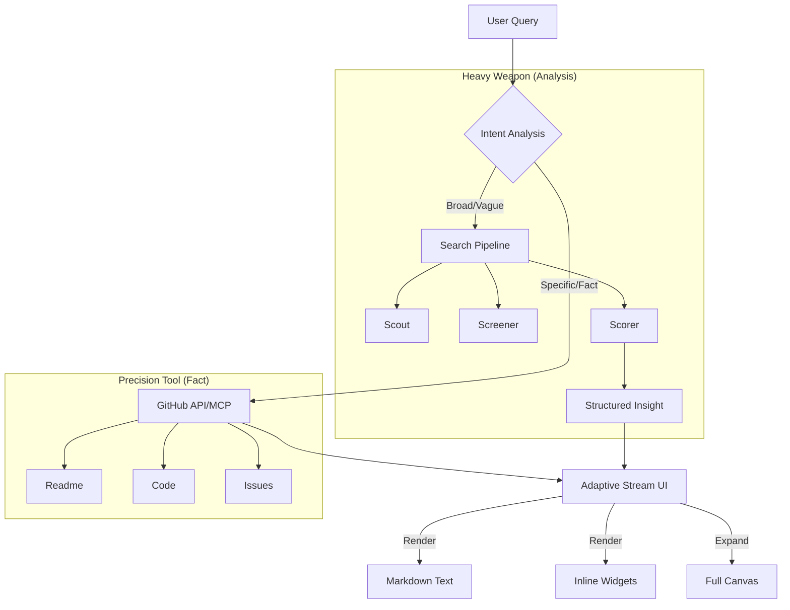

# 🌌 Oh-My-GitHub Vision 2.0

> **North Star (北极星愿景)**: **The Universal Answer Engine for Open Source.**
> 做开源世界的 **Perplexity** —— 一个能直接交付**事实、洞察和代码**的通用智能体。

我们不再将自己局限于 "VC Analyst"（风投分析师），那只是我们的一种能力。我们的目标是构建一个**通用的 GitHub 知识接口**。

---

## 1. Core Philosophy: Answer, Don't Link (核心哲学)

传统的 GitHub Search 返回 10 个蓝色链接，用户需要自己去点、去读、去总结。
**Oh-My-Github 直接交付结果。**

*   **User**: "最好的 React 状态管理库是什么？"
*   **GitHub**: 返回 `redux`, `zustand`, `mobx` 的仓库链接。
*   **Oh-My-Github**: 返回一份**对比分析**，包含活跃度数据、样板代码对比，并给出基于场景的推荐。

**Key Principles:**
1.  **Fact-Based (基于事实)**: 所有回答必须有 GitHub 实时数据支撑，拒绝幻觉。
2.  **Direct Delivery (直接交付)**: 能给代码就给代码，能给图表就给图表，不要只给 URL。
3.  **Universal (通用性)**: 既能做宏观分析（趋势），也能做微观查询（安装文档）。

---

## 2. UX Paradigm: Adaptive Stream (自适应流)

我们要摒弃复杂的“仪表盘”设计，回归最自然的**对话流**。

> **Design Metaphor**: **"Smart Stream + Inline Widgets"**

*   **Default State (默认)**: **Single Column (单栏)**。像聊天一样自然。
*   **Dynamic Content (动态内容)**: Agent 根据内容密度，自动嵌入不同量级的组件：
    *   **Text**: 普通文本回答。
    *   **Inline Widget**: 嵌入在气泡中的轻量组件（如 `<RepoCard />`, `<StatBadge />`, `<CodeSnippet />`）。
    *   **Expandable Canvas**: 只有在展示极复杂内容（如 `<DeepDiveReport />`, `<FullCodeEditor />`）时，才提供“展开”选项，进入宽屏模式。

---

## 3. Technical Architecture: Hybrid Intelligence (混合智能)

Agent 像一个**“带瑞士军刀的特种兵”**，根据问题难度自动切换武器。

### 🧠 The Brain (Router)
LLM 根据用户意图，决定调用哪类工具。

### ⚔️ Left Hand: The Heavy Pipeline (重武器)
> *Powered by our custom LangGraph Workflow*
*   **场景**: 模糊搜索、趋势分析、横向对比、质量评估。
*   **能力**:
    *   `Scout`: 多策略海选。
    *   `Screener`: 垃圾过滤与活跃度清洗。
    *   `Auditor`: 生成多维评分与研报。
*   **Example**: "帮我找几个高质量的 Rust Web 框架。"

### 🔪 Right Hand: The Precision Tools (瑞士军刀)
> *Powered by GitHub API / MCP*
*   **场景**: 事实查阅、文档获取、代码读取、具体操作。
*   **能力**:
    *   `get_readme`: 读取文档。
    *   `read_file`: 读取特定代码。
    *   `get_release_note`: 查看更新日志。
*   **Example**: "Actix-web 怎么配置路由？给我看下它的 main.rs。"

---

## 4. Roadmap: The Evolution (演进路线)

### Phase 1: The Smart Search (智能搜索)
*   **Goal**: 替代 GitHub 搜索框。
*   **Features**:
    *   支持自然语言搜索。
    *   集成 `Search Pipeline`，提供 Top 10 高质量结果。
    *   UI: 流式对话 + `RepoCard` 组件。

### Phase 2: The Deep Reader (深度阅读)
*   **Goal**: 读懂项目。
*   **Features**:
    *   集成 `get_readme` / `read_file` 工具。
    *   支持 "Chat with Repo"（基于 RAG 或长上下文）。
    *   UI: 支持 Markdown 渲染、代码高亮、简单的对比表格。

### Phase 3: The Insight Analyst (洞察分析)
*   **Goal**: 辅助决策。
*   **Features**:
    *   完善 `Auditor` Agent，生成雷达图、活跃度热力图。
    *   UI: 引入 `Expandable Canvas`，展示复杂研报。

### Phase 4: The Contributor (开源贡献)
*   **Goal**: 辅助行动。
*   **Features**:
    *   自动寻找 `Good First Issue`。
    *   生成 Contribution Guide。
    *   (Future) 尝试自动修复简单 Issue。

---

## 📐 Architecture Diagram

