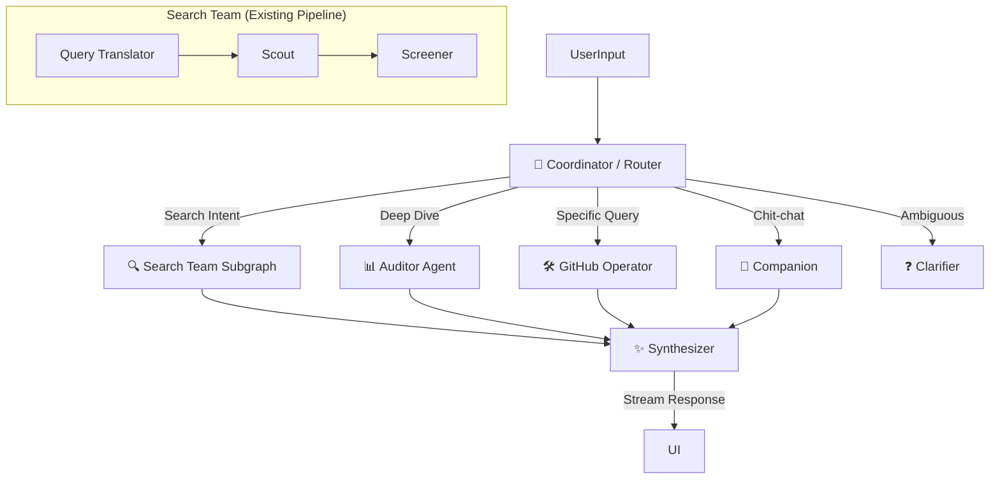

# Oh-My-GitHub Agent Architecture (Draft)

> **Status**: Draft / Proposal (Revised)
> **Date**: 2026-01-19
> **Context**: Proposal 8 (Agent Coordinator)

## 1. 核心理念

本架构采用 **"Flow Engineering" (流工程)** 范式，基于 **LangGraph** 框架构建。

我们不追求完全不可控的 "Autonomous Agents"，而是构建一个 **"Reliable State Machine" (可靠状态机)**。通过显式定义的图（Graph）结构，将 LLM 的灵活性（决策、推理）与代码的确定性（搜索算法、API 调用）完美结合。

## 2. 架构概览 (Hierarchical Topology)

系统采用 **分层拓扑结构**，以 Coordinator 为中心，分发任务给专业的 Sub-agents，最后由 Synthesizer 统一输出。



## 3. 核心组件设计

### 3.1 State Schema (接力棒)

在 LangGraph 中流转的全局状态对象。**严格类型定义**是系统健壮性的基石。

```typescript
import { Annotation, MessagesAnnotation } from "@langchain/langgraph";

// 定义结构化数据的联合类型 (Union Types)
export type StructuredData = 
  | { type: 'repo_list'; items: RepoCardData[] }
  | { type: 'repo_detail'; repo: RepoDetailData; analysis: AnalysisData }
  | { type: 'comparison'; items: RepoComparisonData[] }
  | { type: 'clarification'; options: string[] } // 用于追问用户
  | null;

export const AgentState = Annotation.Root({
  // 1. 基础对话历史 (UserMessage, AIMessage, ToolMessage)
  ...MessagesAnnotation.spec,
  
  // 2. 路由决策
  intent: Annotation<"search" | "direct" | "analyze" | "chat" | "clarify">,
  
  // 3. 结构化数据 (用于前端组件渲染) - 强类型
  structuredData: Annotation<StructuredData>,
  
  // 4. 上下文摘要 (防止 Context Window 爆炸)
  contextSummary: Annotation<string>,
  
  // 5. 用户画像/偏好 (长期记忆)
  userProfile: Annotation<{
    preferredLanguages?: string[];
    skillLevel?: "beginner" | "advanced";
  }>
});
```

### 3.2 Coordinator Node (路由节点)

*   **职责**: 分析用户输入的意图。
*   **逻辑**:
    *   输入: `messages` (历史上下文)
    *   输出: `intent` (枚举值)
    *   **Human-in-the-loop**: 如果意图置信度低于阈值，路由到 `Clarifier` 节点，生成追问选项。

### 3.3 Specialized Agents (专业节点)

#### A. Search Agent (The Hunter)
*   **场景**: "找一个 React 状态库", "类似 Zustand 的库"
*   **实现**: 封装现有的 `h1-search-pipeline`。
*   **集成**: 将现有的 Workflow 作为一个 **Subgraph** 或 **Function Call** 嵌入。
*   **输出**: `repo_list` 类型的数据。

#### B. Direct Agent / Operator (The Worker)
*   **场景**: "React 最新版本是多少", "查看 package.json"
*   **实现**: ReAct Loop (Reason + Act)。
*   **工具集**: **GitHub MCP Tools**
*   **Context Compression (上下文压缩)**: 
    *   读取大文件时，不直接将全文放入 `messages`。
    *   先生成摘要或提取关键片段，存入 `contextSummary` 或作为 Tool Output 的一部分。

#### C. Auditor Agent (The Analyst)
*   **场景**: "深度分析这个库", "它有什么风险"
*   **实现**: 调用多个工具（Issue 分析, 代码质量检查, Star 历史）并聚合数据。
*   **输出**: `repo_detail` 类型的数据。

### 3.4 Synthesizer Node (合成器)

*   **职责**: **"The Editor"**。无论上游是哪个 Agent，最后都由它统一收口。
*   **功能**:
    1.  **Format Unification**: 确保 `structuredData` 符合前端组件 Schema。
    2.  **Final Polish**: 生成最终的 Markdown 总结，确保语气一致（专业、客观）。
    3.  **UI Decision**: 决定前端应该渲染哪个组件（是显示列表，还是显示对比表）。

### 3.5 Response Generator (响应生成)

*   **协议**: Server-Sent Events (SSE)。
*   **格式**: JSON Lines (Vercel AI SDK Data Stream Protocol)。
*   **类型**:
    *   `log`: 思考过程 ("正在搜索 GitHub...", "正在读取文件...")
    *   `text`: 增量文本流
    *   `data`: 结构化 JSON 数据 (RepoCard, ComparisonTable)

## 4. 关键流程 (Data Flow)

### 场景 1: 模糊搜索
1.  **User**: "推荐个 React 状态库"
2.  **Coordinator**: 路由 -> `Search Agent`。
3.  **Search Agent**: 运行 Pipeline -> 产出 `repo_list` 数据。
4.  **Synthesizer**: 
    *   检查数据完整性。
    *   生成总结："为您找到以下库，推荐 Zustand..."。
    *   输出 `structuredData` 给前端渲染卡片。

### 场景 2: 深度分析 (带上下文压缩)
1.  **User**: "分析一下它的 package.json 依赖"
2.  **Coordinator**: 路由 -> `Direct Agent`。
3.  **Direct Agent**: 
    *   调用 `read_file('package.json')`。
    *   **压缩**: 文件太大，只提取 `dependencies` 和 `peerDependencies` 部分。
    *   分析依赖健康度。
4.  **Synthesizer**: 生成依赖分析报告。

## 5. 技术栈

*   **Orchestration**: **LangGraph.js** (State Management, Persistence)
*   **Tools**: GitHub MCP Server
*   **Runtime**: Next.js API Routes
*   **Streaming**: Vercel AI SDK (Data Stream Protocol)

## 6. 下一步计划

1.  **Setup**: 初始化 LangGraph 基础结构 (`AgentState` with Union Types)。
2.  **Synthesizer**: 实现统一的输出层。
3.  **MCP Integration**: 引入 GitHub MCP 工具定义。
4.  **Coordinator**: 实现意图分类器。
